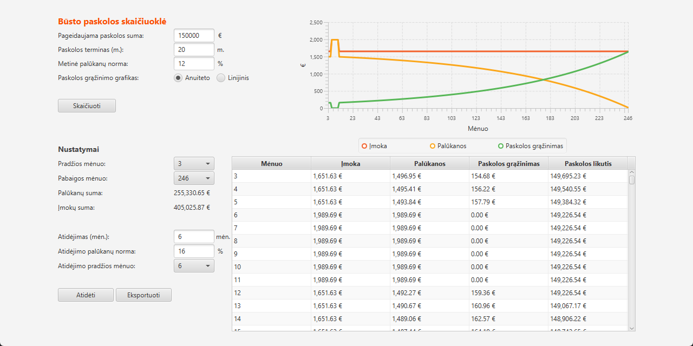
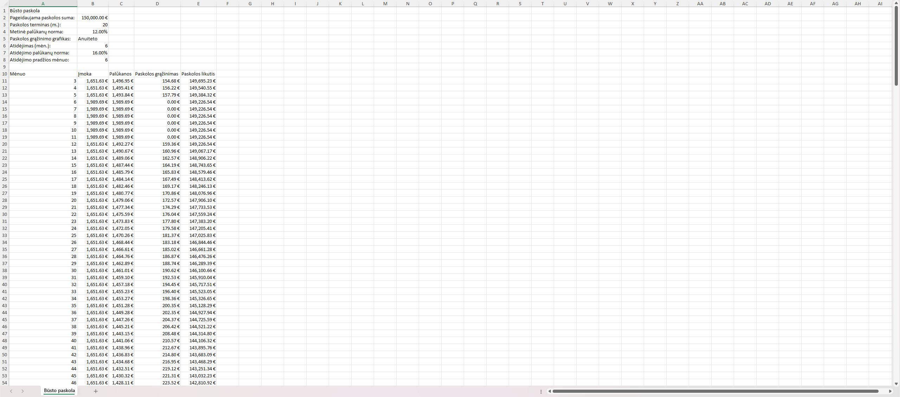

# Mortgage calculator
A mortgage calculator created with JavaFX library. It was written during the 2nd semester of Software Engineering at Vilnius University for Object-Oriented Programming course (2023). The project implements:
- Annuity and linear mortgage calculation;
- Payment deferral with a custom interest rate;
- Payment representation in a table;
- Payment representation in a graph;
- Payment filtering by the given months;
- Data exportation to a spreadsheet.

## Examples
**Main screen**

**Spreadsheet**
